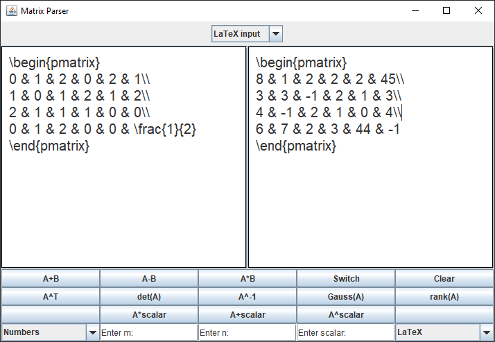
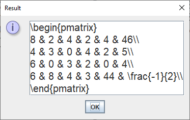
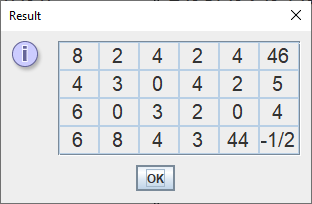
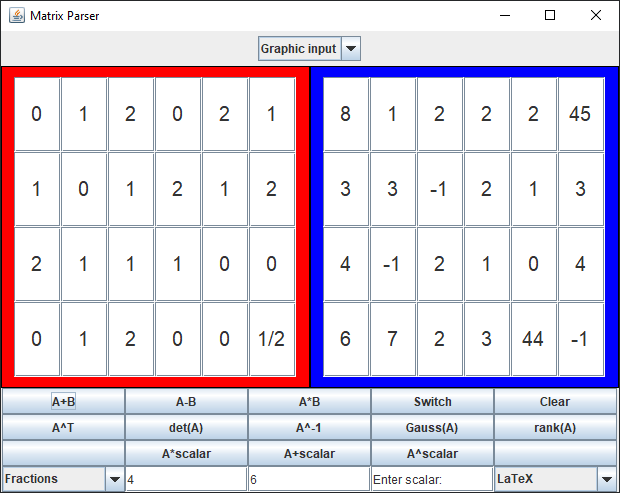

# User documentation

For running and compiling the code, see the [README](../README.md) in the root directory. In short, the command `mvn compile exec:java` should work for running the tool.

After running the tool, the user may enter the matrices via text areas. If the user wants to change the input to a graphical interface, they may do it via the combo box on the top.



When the user has entered the matrices, they may use the buttons on the bottom to perform operations on the matrices. The result is shown in a dialog box. The user may switch between a graphical output and a LaTeX output via the combo box in the bottom right corner. The user may also choose between a decimal output and a fraction output via the combo box in the bottom left corner.

This is an example of a LaTeX output of A + B (for the matrices A and B in the example above):



This is an example of a graphical output of A + B (for the matrices A and B in the example above):



The program should automatically check for invalid inputs and operations and gives an error message if the input is invalid.

On the bottom of the buttons section, the user may input three numbers. A scalar, which represents a value that is either multiplied with the matrix or added to the matrix, and two values for choosing the dimensions of the matrix when in the graphical interface.

This is an example of a graphical input of the same matrices as in the examples above:



Currently, working with irrational numbers is not supported, but the user still may work with an approximations.

Some examples of LaTeX matrices:

```latex
\begin{pmatrix}
8 & 1 & 2 & 2 & 2 & 45\\
3 & 3 & -1 & 2 & 1 & 3\\
4 & -1 & 2 & 1 & 0 & 4\\
6 & 7 & 2 & 3 & 44 & -1
\end{pmatrix}

\begin{pmatrix}
0 & 1 & 2 & 0 & 2 & 1\\
1 & 0 & 1 & 2 & 1 & 2\\
2 & 1 & 1 & 1 & 0 & 0\\
0 & 1 & 2 & 0 & 0 & \frac{1}{2}
\end{pmatrix}

\left( \begin{array}{cccc}
2 & -3 & 1 & 4\\
4 & 1 & -5 & -3\\
\end{array}\right)

\left( \begin{array}{ccc}
1 & 2 & 8\\
0 & 1 & -2\\
0 & -1 & 3\\
\end{array}\right)
```

# Programming documentation
- TODO